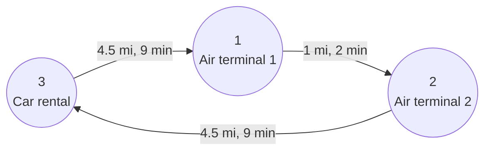
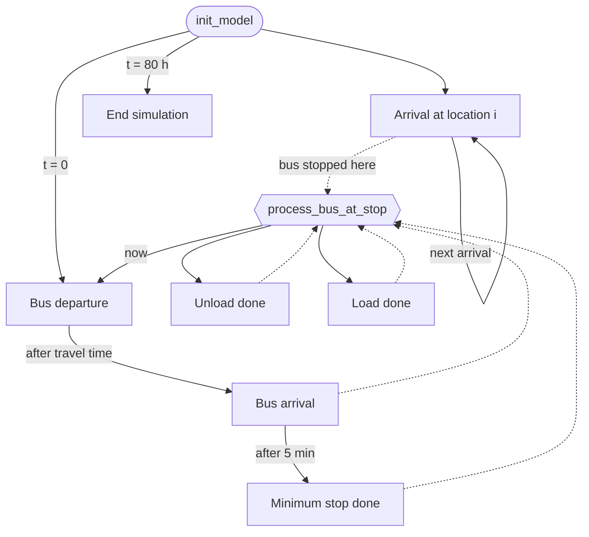
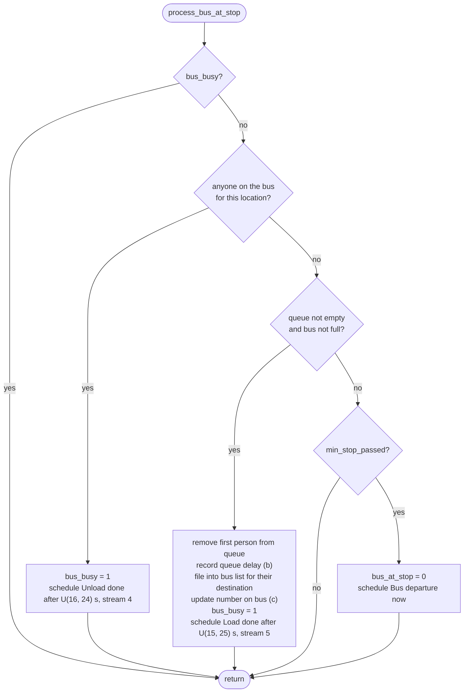
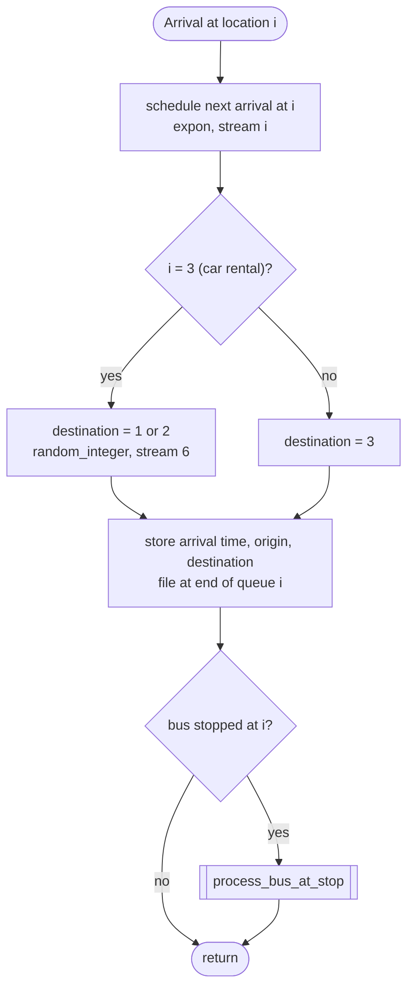
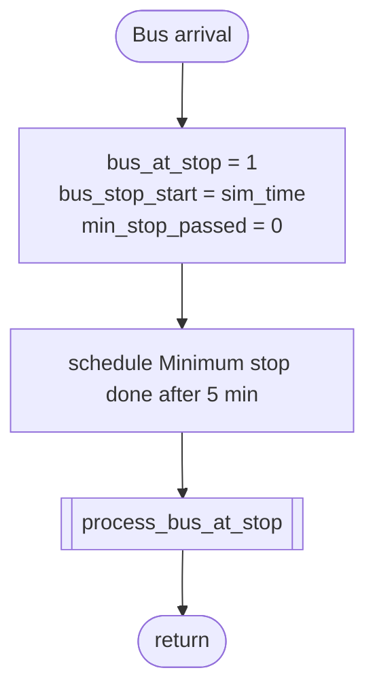
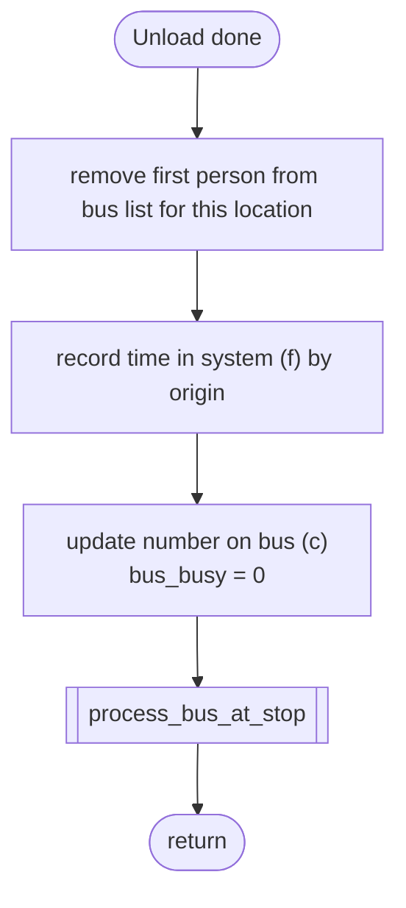
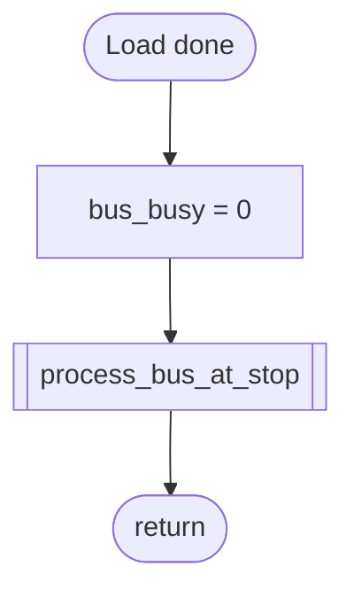
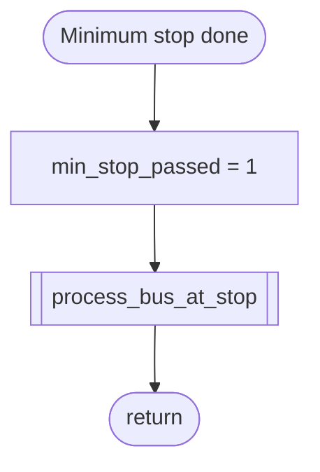
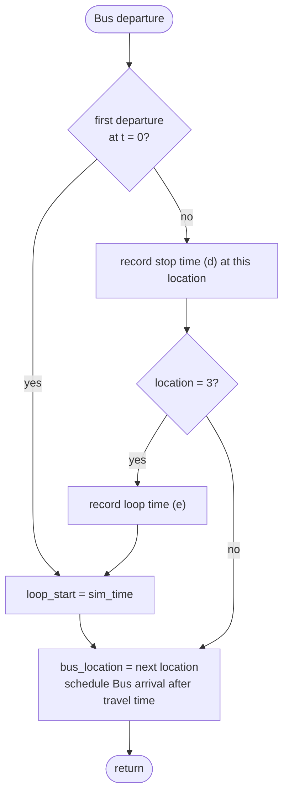

# Bus Event Simulation

A shuttle bus queueing simulation written in C using the SIMLIB library.

## Description

This project simulates Problem 2.38 from Averill M. Law, *Simulation Modeling and Analysis*: a single shuttle bus serving two air terminals and a car rental. It is a discrete-event simulation built with SIMLIB.

### System

People arrive at three locations and wait in FIFO queues with unlimited capacity. One bus, with a capacity of 20 people and a speed of 30 miles per hour, drives a counterclockwise loop. It starts at the car rental and departs immediately at time 0.



| Item | Value |
|---|---|
| Arrival rate at locations 1, 2, 3 | 14, 10, 24 per hour (exponential interarrival times) |
| Destination | From a terminal: always the car rental. From the car rental: terminal 1 (p = 0.583) or terminal 2 (p = 0.417) |
| Unloading time per person | Uniform(16, 24) seconds |
| Loading time per person | Uniform(15, 25) seconds |
| Minimum stop time | 5 minutes at each location |
| Simulation length | 80 hours |
| Random-number streams | 1–3: interarrival times at location i, 4: unloading, 5: loading, 6: destination at the car rental |

When the bus arrives at a location, it first unloads passengers for that location (FIFO), then loads people from the queue up to its capacity (FIFO). It always stays at least 5 minutes, and leaves as soon as no loading or unloading is in process after that.

### Statistics

- (a) Average and maximum number in each queue
- (b) Average and maximum delay in each queue
- (c) Average and maximum number on the bus
- (d) Average, maximum, and minimum time the bus is stopped at each location
- (e) Average, maximum, and minimum time for the bus to make a loop (departure from the car rental to the next such departure)
- (f) Average, maximum, and minimum time a person is in the system, by arrival location

### Interpretations

- A person who arrives while the bus is stopped at their location can board, as long as the bus is not full.
- After the minimum stop time, the bus keeps loading until the queue is empty or the bus is full, and only then departs.
- A person counts as being on the bus from the moment they start loading until they finish unloading.
- A person's time in the system ends when they finish unloading at their destination.

See [Event Flowcharts](#event-flowcharts) for how the model is implemented.

## Prerequisites

| Requirement | Description |
|---|---|
| C compiler | `gcc` or `clang` |
| `make` | To run the Makefile |

## Project Structure

```
bus-event-simulation/
├── src/
│   ├── bus.c               # main simulation program
│   └── simlib/             # SIMLIB library
│       ├── simlib.c
│       ├── simlib.h
│       └── simlibdefs.h
├── data/
│   ├── bus.in              # simulation input parameters
│   └── bus.out             # simulation results
├── docs/
│   └── laporan.pdf
├── bin/
│   └── bus
├── Makefile
├── .gitignore
└── README.md
```

## Setup

### macOS

Install Apple's Command Line Tools (includes `gcc` and `make`):

```bash
xcode-select --install
```

### Linux (Ubuntu/Debian)

```bash
sudo apt install build-essential
```

### Verify installation

```bash
gcc --version
make --version
```

### Clone the repository

```bash
git clone https://github.com/carllix/bus-event-simulation.git
cd bus-event-simulation
```

## Build and Run

Run all commands from the project root directory.

| Command | Description |
|---|---|
| `make` | Compile the program to `bin/bus` |
| `make run` | Compile (if needed) and run the simulation |
| `make clean` | Remove the `bin/` directory and `data/bus.out` |

Quickest way to get started:

```bash
make run
```

The simulation results are saved to `data/bus.out`. To view them:

```bash
cat data/bus.out
```

> Always run `make` from the project root, since the input and output paths (`data/bus.in` and `data/bus.out`) are relative to that directory.

## Parameter Configuration

Simulation parameters are read from `data/bus.in`, so they can be changed without recompiling.

```
14 10 24
0.583 0.417
20 30
16 24
15 25
5
80
```

| Line | Parameter |
|---|---|
| 1 | Arrival rates at locations 1, 2, 3 (people per hour) |
| 2 | Destination probabilities from the car rental to terminal 1 and terminal 2 |
| 3 | Bus capacity (people) and bus speed (miles per hour) |
| 4 | Lower and upper bounds of unloading time per person (seconds) |
| 5 | Lower and upper bounds of loading time per person (seconds) |
| 6 | Minimum stop time at each location (minutes) |
| 7 | Simulation length (hours) |

## Event Flowcharts

### Bus State Variables

| Variable | Meaning |
|---|---|
| `bus_location` | Location where the bus is stopped, or the location it is heading to |
| `bus_at_stop` | 1 if the bus is stopped at a location, 0 if it is traveling or about to depart |
| `bus_busy` | 1 if a person is currently being loaded or unloaded |
| `min_stop_passed` | 1 if the bus has been stopped for at least the minimum stop time |
| `bus_stop_start` | Time the bus arrived at its current location |
| `loop_start` | Time of the last departure from the car rental |

A person counts as being on the bus from the moment they start loading until they finish unloading.

### Event Overview

Solid arrows schedule an event, dashed arrows call `process_bus_at_stop()` directly.



### process_bus_at_stop

Called whenever the state of a stopped bus changes. It unloads first, then loads, then departs.



### Arrival at Location i (events 1–3)



### Bus Arrival (event 4)



### Unload Done (event 5)



### Load Done (event 6)



### Minimum Stop Done (event 7)



### Bus Departure (event 8)



### End Simulation (event 9)

Calls `report()`, which writes the parameters and statistics (a)–(f) to `data/bus.out`, and the simulation stops.

## Authors

<table>
  <tr>
    <td align="center">
      <a href="https://github.com/himanusia">
        <br />
        <span><b>Ahmad Ibrahim</b></span><br/>
        <p>13523089</p>
      </a>
    </td>
    <td align="center">
      <a href="https://github.com/carllix">
        <br />
        <span><b>Carlo Angkisan</b></span><br/>
        <p>13523091</p>
      </a>
    </td>
  </tr>
</table>